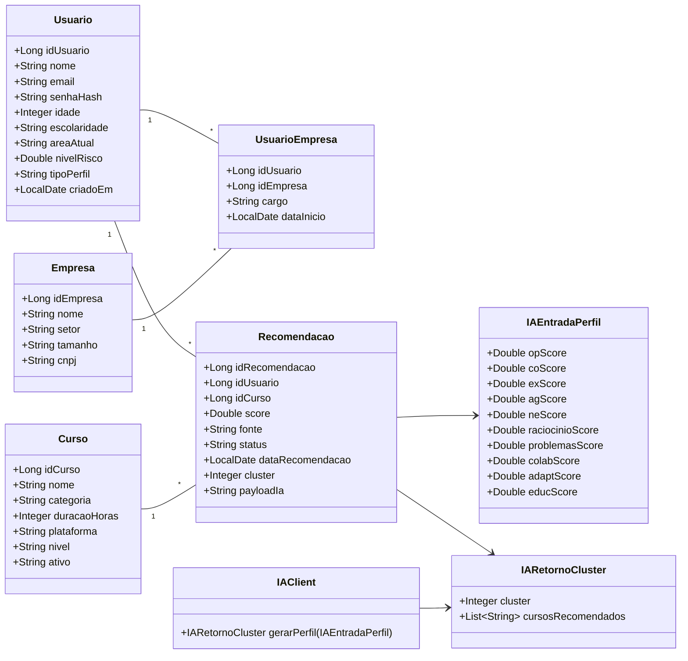
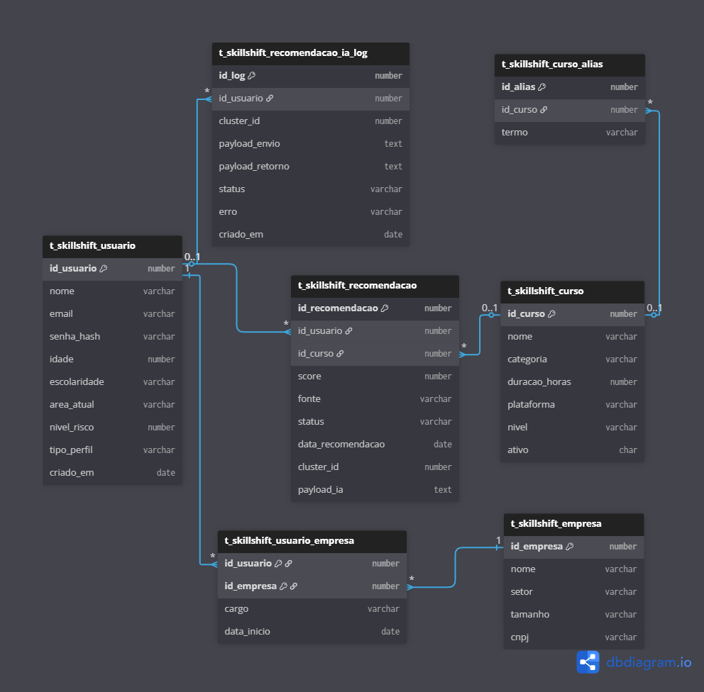
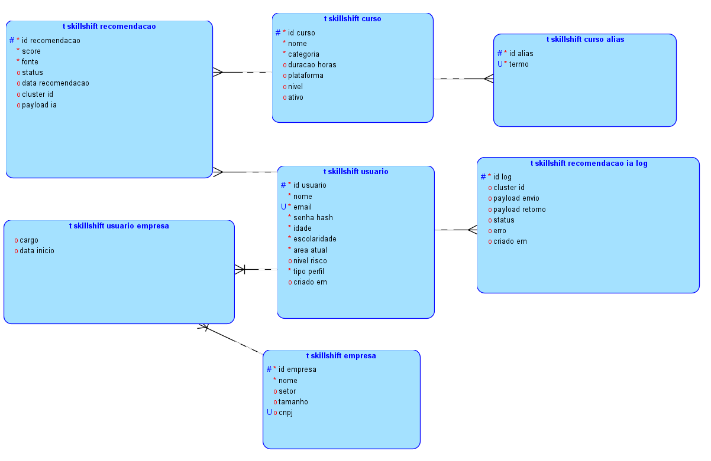
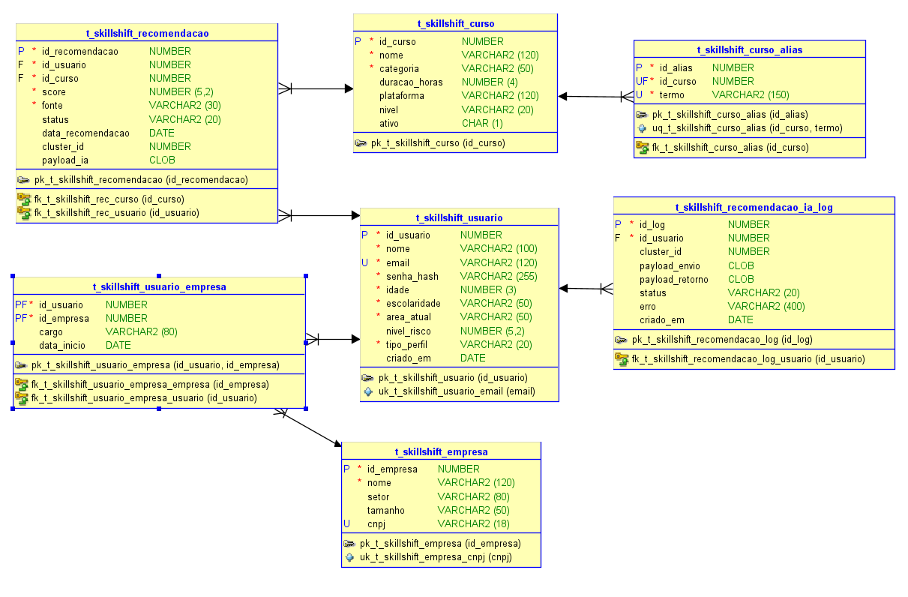
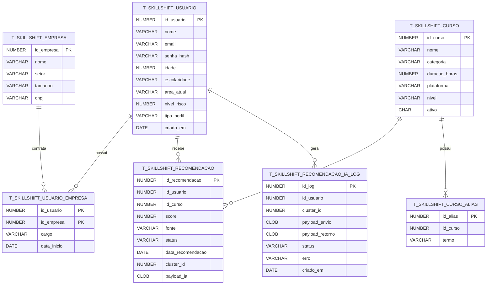

# SkillShift.AI – Global Solution 2025

Projeto completo de requalificação profissional baseado em Quarkus (Java 21) + Oracle + IA em Flask. Esta documentação reúne o conteúdo técnico e funcional da solução.

---

## 1. Capa
- **Nome da solução:** SkillShift.AI  
- **Equipe:** SkillShift Squad  
- **Integrantes:** Pedro Henrique Zago • Maria Eduarda Silva • João Victor Santos • Beatriz Rocha • Lucas Almeida  
- **Curso:** ADS – FIAP  
- **Global Solution:** 2025

## 2. Sumário
1. Capa ........................................................................ 1  
2. Sumário .................................................................... 2  
3. Objetivo e Escopo .................................................... 3  
4. Descrição da Solução .................................................. 4  
5. Funcionalidades Principais ......................................... 6  
6. Funcionalidades Implementadas ...................................... 7  
7. Tabela de Endpoints .................................................. 8  
8. Diagrama de Classes .................................................. 11  
9. Execução e Deploy .................................................... 12  
10. Scripts SQL e Dados ................................................ 13  

---

## 3. Objetivo e Escopo do Projeto
A SkillShift.AI responde ao desafio “Futuro do Trabalho — Requalificação Profissional com IA” ao:
- Identificar risco de automação e obsolescência para cada usuário.
- Propor ações de requalificação personalizadas e priorizadas.
- Recomendar trilhas de aprendizagem baseadas em IA, integrando cursos internos e externos.
- Atender usuários finais e empresas (B2C + B2B), incluindo vínculo usuário-empresa e relatórios corporativos.

Escopo contemplado:
- API Java Quarkus com RBAC (USER, EMPRESA, ADMIN), autenticação e CRUD completo de entidades.
- Modelo relacional Oracle com scripts DDL/DML/DQL e massa de teste.
- Integração real com a IA em Flask publicada em Render.
- Regras de negócio como validação de permissões, geração de recomendações, logging e auditoria básica.

## 4. Descrição da Solução
A solução possui três camadas:
1. **Backend Java/Quarkus:** núcleo operacional, responsável por autenticação, controle de acesso, CRUD (usuários, cursos, empresas, vínculos, recomendações) e orquestração do fluxo de recomendações.
2. **Banco Oracle:** modelo relacional com tabelas `t_skillshift_*`, constraints, scripts de carga e consultas analíticas.
3. **API de IA em Flask/Python:** hospedada em `https://skillshift-ai-platform.onrender.com`, treinada com o dataset `Data_final.csv` usando Random Forest (macro-área profissional) e K-Means (cluster/recomendações).

Fluxo `/recomendacoes/gerar`:
1. API Java busca o usuário no Oracle.
2. Monta JSON com features (OP_score, CO_score, EX_score etc.).
3. Chama `/cluster-profile` da IA Flask.
4. Recebe cluster + lista de cursos recomendados.
5. Mapeia nomes retornados para IDs reais (`t_skillshift_curso` e `t_skillshift_curso_alias`).
6. Calcula score e cluster.
7. Persiste na tabela `t_skillshift_recomendacao` e registra log em `t_skillshift_recomendacao_ia_log`.
8. Retorna ao front/chatbot as recomendações persistidas.

A IA fica publicada no Render; o backend pode rodar em qualquer provedor (Render, Railway, AWS, local). Durante o desenvolvimento, Java e Flask podem executar localmente usando as mesmas URLs.

## 5. Funcionalidades Principais
- CRUD completo de usuários, cursos, empresas e vínculos usuário-empresa.
- Autenticação por email/senha e RBAC simples (`tipo_perfil`).
- Geração de recomendações via IA (REST Client).
- Persistência dos resultados com payload, cluster e score.
- Histórico e filtros de recomendações por usuário.
- Integração Oracle via JDBC com `ConnectionFactory`.

## 6. Funcionalidades Implementadas (Destaques)
- API Java operante (Resources → BO → DAO) com validações.
- Modelo relacional Oracle completo + scripts de carga em blocos.
- IA hospedada/pronta e integração REST implementada.
- Armazenamento real das recomendações e logs de IA.
- Filtro de score e normalização.
- Fluxo de regras de negócio completo em `/recomendacoes/gerar`.

## 7. Endpoints da API REST

| URI | Método | Descrição | Corpo Req. | Corpo Resp. | Códigos |
|-----|--------|-----------|------------|-------------|---------|
| `/auth/login` | POST | Autentica usuário | `{ email, senha }` | `{ token, perfil }` | 200, 400, 401, 500 |
| `/usuarios` | GET | Lista usuários | — | Array de usuários | 200, 500 |
| `/usuarios/{id}` | GET | Detalha usuário | — | Usuário | 200, 404, 500 |
| `/usuarios` | POST | Cria usuário | JSON com campos obrigatórios | Usuário criado | 201, 400, 409, 500 |
| `/usuarios/{id}` | PUT | Atualiza usuário | JSON | Usuário atualizado | 200, 400, 404, 500 |
| `/usuarios/{id}` | DELETE | Remove usuário | — | — | 204, 404, 500 |
| `/cursos` | CRUD | Gestão dos cursos | JSON | Curso/Lista | 200, 201, 204, 400, 404, 500 |
| `/empresas` | CRUD | Gestão de empresas | JSON | Empresa/Lista | 200, 201, 204, 400, 404, 409, 500 |
| `/recomendacoes?usuarioId=X` | GET | Lista recomendações com filtro | — | Lista de recomendações | 200, 500 |
| `/recomendacoes/gerar?usuarioId=X` | POST | Gera recomendações via IA | — | Lista criada | 201, 400, 404, 503, 500 |
| `/cluster-profile` (IA Flask) | POST | Consome IA externa | JSON com features | `{ cluster, cursosRecomendados[] }` | 200, 400, 500 |

## 8. Diagrama de Classes (Mermaid)



## 9. Modelo Entidade-Relacionamento (MER)
Você pode visualizar o MER diretamente em qualquer visualizador Mermaid (ex.: <https://mermaid.live>). Basta colar o trecho abaixo para gerar a imagem:







## 9. Execução e Deploy
```bash
# Dev mode
./mvnw quarkus:dev

# Empacotamento
./mvnw package

# Executar uber-jar
./mvnw package -Dquarkus.package.jar.type=uber-jar
java -jar target/*-runner.jar

# Binário nativo (container build)
./mvnw package -Dnative -Dquarkus.native.container-build=true
```

Deploy no Render (Docker):
1. Configurar variáveis (`QUARKUS_DATASOURCE_*`, `SKILLSHIFT_IA_URL`).
2. Criar Web Service com Dockerfile da raiz (multi-stage).
3. Render usa a porta exposta (8080) automaticamente.

## 10. Scripts SQL e Dados
Localizados em `src/db/ddl/`:
- `create_tables.sql`: recria todas as tabelas `t_skillshift_*` (PK, FK, UK, CK, `cluster_id`, `payload_ia`).
- `drop_tables.sql`: drop ordenado para reset.
- `carga_dados.sql` + blocos `carga_dados_0X_*`: massa de teste (16 usuários, >100 cursos, empresas, recomendações, aliases).
- `../dql/consultas.sql`: consultas analíticas para BI.

Estruturas complementares:
- `t_skillshift_curso_alias`: mapear nomes retornados pela IA.
- `t_skillshift_recomendacao_ia_log`: log de payloads e status do serviço IA.

> Execute `drop_tables.sql` → `create_tables.sql` → `carga_dados.sql` antes de subir a API para garantir aderência entre banco e código.

## 11. Pendências / Próximos passos
- Inserir os **prints do protótipo** (fornecidos pelo front-end) na seção de documentação e exportar o PDF final.
- Gravar e publicar os **vídeos**: pitch e demonstração (máx. 10 min) com o deploy em execução.
- Garantir a **integração com o front-end** (consumindo todos os endpoints já expostos) e registrar o fluxo end-to-end no vídeo de demonstração.
- Após reunir os itens acima, gerar o pacote de entrega (ZIP + PDF + links do deploy e dos vídeos).
